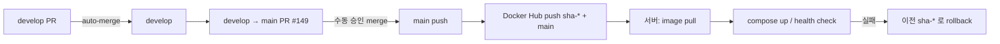

# Production 배포 전략 결정안

> **상태**: 결정안(문서). **실제 배포·CD workflow 구현은 아직 없음.**  
> secret·credential 값은 이 문서에 적지 않는다. [main release 준비 체크리스트](./main-release-readiness.md)와 함께 본다.

## 목적

`develop` → `main` merge 및 Docker Hub image push **이후**, 운영 서버에 어떻게 배포할지 1차 전략을 고정한다.
[PR #149](https://github.com/chorok447/dasida/pull/149)는 **2026-07-03 merge 완료** — main push 로 Docker Hub image push 까지 확인됨. **서버 deploy 는 아직 미구현.**

---

## 배포 후보 비교

| 방식 | 장점 | 단점 | Dasida 적합도 |
|------|------|------|----------------|
| **Docker Compose on VM** | Docker Hub image 그대로 사용; API/Web/MySQL/Redis를 한 서버에서 단순 기동; 로컬 `compose.local.yml`과 개념 유사 | 단일 VM SPOF; 수동/스크립트 운영 필요; secret은 서버 `.env` 관리 | **★ 1차 추천** |
| **VM + systemd** | OS 서비스로 장기 운영에 익숙; jar 직접 실행도 가능 | image 기반일 때 compose 대비 이점 적음; Web(pnpm) 단위 관리가 번거로움 | 차선 |
| **Managed container** (ECS, Cloud Run, App Service 등) | 오토스케일·관리형 LB·secret 연동 | 초기 설정·비용·벤더 lock-in; 현재 CD 미구현 | **추후 전환 후보** |
| **Kubernetes** | 대규모·다중 리전·고가용 | 현재 팀/트래픽 규모 대비 과함; 운영 부담 큼 | **보류** |
| **정적 Web hosting + API container 분리** | Web을 CDN/정적 호스팅으로 분리 가능 | Next.js `pnpm start`(SSR/동적 라우트)는 **현재 Web image**와 맞지 않음; 별도 static export 전략 필요 | **현 구조와 불일치** (장기 검토) |

---

## 1차 추천: Docker Compose on VM

**Public ingress**: 호스트 **Nginx** reverse proxy(80/443) — [nginx-reverse-proxy-deployment.md](./nginx-reverse-proxy-deployment.md).

**초기 single VM**: Nginx(host) + Compose(web/api/mysql/redis) — [single-vm-compose-deployment.md](./single-vm-compose-deployment.md).

### 추천 이유

1. **Docker Hub image와 정합** — `docker.io/<DOCKERHUB_USERNAME>/dasida-api`, `dasida-web`를 서버에서 `docker compose pull` 후 기동하면 된다.
2. **구성 단순** — MySQL, Redis/Valkey, API, Web을 하나의 compose stack으로 시작할 수 있다(로컬 `compose.local.yml` 패턴과 유사).
3. **현재 규모에 적합** — 소규모 단일 서버로 시작하고, 트래픽·가용성 요구가 커지면 managed service로 이전 가능.
4. **Kubernetes 불필요** — 당장 replica·HPA·service mesh가 필요하지 않다.

### 아직 구현되지 않은 것 (TODO)

- **예시 template**: [`deploy/compose.prod.example.yml`](../../../../deploy/compose.prod.example.yml) + [`deploy/compose.single-vm.example.yml`](../../../../deploy/compose.single-vm.example.yml) (single VM) + [`deploy/.env.prod.example`](../../../../deploy/.env.prod.example) — **실제 서버 deploy/CD 는 아직 없음.**
- CD workflow의 실제 deploy step — [`.github/workflows/cd.yml`](../../../../.github/workflows/cd.yml) placeholder
- Docker Hub pull 인증(서버 credential) — **미설정**

---

## Docker Compose on VM — 운영 개요

### Image pull

```text
docker.io/<DOCKERHUB_USERNAME>/dasida-api:<tag>
docker.io/<DOCKERHUB_USERNAME>/dasida-web:<tag>
```

서버 `.env.prod` 의 `DOCKERHUB_USERNAME` 과 `DASIDA_IMAGE_TAG` 로 compose image 를 pin 한다. private repository 이면 서버에서 `docker login` 후 pull 한다.

**Platform**: CI image 는 `linux/amd64` 전용이다([container-images.md](./container-images.md)). amd64 서버에서는 추가 옵션 없이 pull 가능하다. Apple Silicon 로컬 검증 시 `docker pull --platform linux/amd64` 가 필요하다.

### Tag 전략

| Tag | 용도 | 권장 |
|-----|------|------|
| `sha-<shortsha>` | **배포 고정** — 롤백 단위 | **운영 배포는 이 tag를 pin** |
| `main` | 최신 main 추적·참조용 | 자동 redeploy 트리거로만 쓰지 말 것(의도치 않은 업그레이드 방지) |

main merge 후 Docker Hub 에 `sha-*`와 `main`이 함께 push 된다([container-images.md](./container-images.md)).

### Runtime env 주입

- **서버 `.env`** 또는 **호스트 secret manager**(1Password, cloud SM 등)로 주입.
- **GitHub repository secret에 prod DB/JWT를 넣지 않아도 됨** — 배포 주체가 서버라면 서버 측 주입이 1차 추천.
- Web image의 `NEXT_PUBLIC_API_URL`은 **image build 시 bake-in** — 운영 URL 확정 후 해당 `sha-*` Web image를 빌드·배포해야 한다(`vars.NEXT_PUBLIC_API_URL` 또는 build arg).

### DB / Redis: compose 내장 vs external

| 옵션 | 장점 | 단점 | 1차 권장 |
|------|------|------|----------|
| **External managed DB/Redis** | 백업·패치·HA 위임; compose는 API/Web만 | 비용·네트워크 설정 | **운영 인프라 확정 전까지 권장** |
| **Compose에 MySQL/Valkey 포함** | 단일 VM으로 빠른 시작 | 데이터 durability·백업 직접 책임; VM 장애 시 DB 동반 | 개발/스테이징·초기 PoC |

prod 다중 API replica를 쓸 경우 rate limit·logout denylist는 **공유 Redis store**가 필요하다([redis-security-store-policy.md](./redis-security-store-policy.md)). 그 전까지는 단일 API 인스턴스 + in-memory store도 가능하나, scale-out 시 **Redis 전환 + external Redis**가 선행되어야 한다.

---

## 필요한 운영 변수 (이름만)

값은 서버 env / secret manager에만 둔다. **저장소·이 문서에 커밋하지 않는다.**

### API

| 변수 | 비고 |
|------|------|
| `SPRING_PROFILES_ACTIVE` | `prod` |
| `JWT_SECRET` | ≥32바이트, `dev-insecure` 접두 금지 |
| `DB_URL` | JDBC URL |
| `DB_USER` | MySQL 사용자 |
| `DB_PASSWORD` | MySQL 비밀번호 |
| `APP_CORS_ALLOWED_ORIGINS` | 운영 Web origin(comma-separated) |
| `SPRING_DATA_REDIS_HOST` | Redis/Valkey (store 전환·다중 인스턴스 시) |
| `SPRING_DATA_REDIS_PORT` | 기본 6379 |
| `SPRING_DATA_REDIS_PASSWORD` | 인증 사용 시 |

추가 설정(별도 구현 PR): `app.rate-limit.store=redis`, `app.auth.denylist.store=redis`.

### Web

| 변수 | 비고 |
|------|------|
| `NEXT_PUBLIC_API_URL` | **build arg** — 운영 API URL. 런타임 env만으로는 이미 빌드된 image에서 바뀌지 않음 |

`NODE_ENV=production`은 `Dockerfile.prod` 기본값.

### Compose / image pull

| 변수 | 비고 |
|------|------|
| `DOCKERHUB_USERNAME` | Docker Hub namespace ([`.env.prod.example`](../../../../deploy/.env.prod.example)) |
| `DASIDA_IMAGE_TAG` | `sha-<shortsha>` pin 권장 |

---

## Release flow (현재 정책)



| 단계 | 동작 | 현재 상태 |
|------|------|-----------|
| develop PR | CI pass 후 **auto-merge** | 구현됨 |
| develop → main PR | CI + container build 검증; **수동 merge** | **merge 완료** (2026-07-03, `af5082c`) |
| main push | Docker Hub `dasida-api` / `dasida-web` push | **완료** — `chorok446/dasida-*:main`, `:sha-af5082c` |
| 서버 deploy | pull + compose + health | **미구현** |
| rollback | 이전 `sha-<shortsha>` tag로 redeploy | runbook만(문서) |

### Post-deploy smoke (배포 구현 후)

- Docker Hub image pull 성공
- container 기동(non-root)
- `GET /actuator/health` → 200
- signup / login / logout / rate limit 기본 smoke
- 브라우저 CORS (운영 origin)

### Pre-deploy image smoke (2026-07-03, 서버 deploy 없음)

main push image 에 대해 로컬에서 pull/smoke 를 수행했다. 상세: [container-images.md](./container-images.md#docker-hub-검증-main-push-2026-07-03).

| 항목 | 결과 |
|------|------|
| Docker Hub push | `chorok446/dasida-api|web` — `main`, `sha-af5082c` (동일 digest) |
| Web smoke | HTTP 200, Next.js 기동 정상 (`--platform linux/amd64` on Apple Silicon) |
| API smoke | Spring Boot 기동 확인; DB/env 없으면 dialect 오류 종료(예상) |
| compose `config` dry-run | `DOCKERHUB_USERNAME=chorok446`, `DASIDA_IMAGE_TAG=sha-af5082c` 성공 |
| `NEXT_PUBLIC_API_URL` | **placeholder** — 운영 URL 확정·재빌드 전까지 API 연동 검증 제한 |

---

## Rollback

1. 배포 시 사용한 `sha-<shortsha>` 를 배포 기록에 남긴다.
2. 장애 시 compose manifest의 image tag를 **이전 sha**로 되돌리고 `docker compose up -d` (또는 동일 runbook).
3. `main` tag는 “최신” pointer이므로 rollback pin으로 쓰지 않는다.
4. Web URL 변경이 있었다면 해당 시점의 **Web image sha**도 함께 되돌려야 한다.
5. DB schema migration 도구는 현재 없음 — rollback은 **애플리케이션 image** 수준.

---

## 후속 작업 (코드/인프라 PR로 분리)

1. ~~운영 compose manifest 초안~~ → **예시 template** [`deploy/compose.prod.example.yml`](../../../../deploy/compose.prod.example.yml) (서버 runbook·실제 `compose.prod.yml` 은 deploy 시 복사·커스터마이즈)
2. ~~Single VM compose override~~ → [`deploy/compose.single-vm.example.yml`](../../../../deploy/compose.single-vm.example.yml) — [single-vm-compose-deployment.md](./single-vm-compose-deployment.md)
3. Nginx reverse proxy runbook (host install, vhost, TLS) — [nginx-reverse-proxy-deployment.md](./nginx-reverse-proxy-deployment.md)
4. 서버 runbook: Docker Hub login, pull, deploy, rollback, DB backup — [single-vm-production-deploy-runbook.md](./single-vm-production-deploy-runbook.md)
5. CD workflow에 opt-in deploy job (명시 승인 후)
6. prod Redis store 설정 PR (필요 시)
7. [main-release-readiness.md](./main-release-readiness.md) 체크리스트 항목 완료
8. `NEXT_PUBLIC_API_URL` 등록 후 Web image 재빌드
9. (optional) `linux/arm64` multi-arch build

---

## 관련 문서

- [github-secrets-and-environments.md](./github-secrets-and-environments.md) — Secrets/Variables·Environment
- [main-release-readiness.md](./main-release-readiness.md) — merge 전 체크리스트
- [container-images.md](./container-images.md) — Docker Hub·CI
- [nginx-reverse-proxy-deployment.md](./nginx-reverse-proxy-deployment.md) — Nginx ingress·TLS·도메인
- [single-vm-compose-deployment.md](./single-vm-compose-deployment.md) — VM 1대 Compose·volume·스펙
- [single-vm-production-deploy-runbook.md](./single-vm-production-deploy-runbook.md) — amd64 VM 배포 runbook (문서만)
- [redis-security-store-policy.md](./redis-security-store-policy.md) — rate limit / denylist
