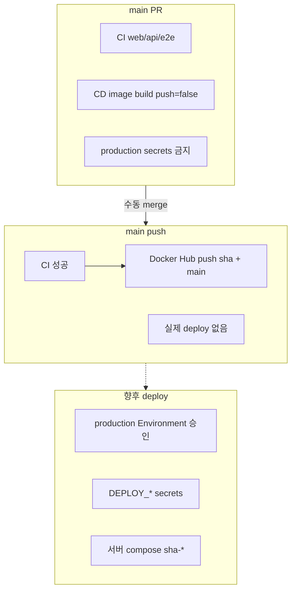

# GitHub Secrets, Variables, Environment

> **상태**: 정책 + 생성 runbook 통합 문서.
> secret·credential **값은 이 문서·저장소에 적지 않는다.** 값은 GitHub UI/CLI 입력 시에만 붙여넣고, 로그·PR·이슈·커밋에 남기지 않는다.

관련: [main release 준비 체크리스트](./main-release-readiness.md), [deployment 전략](./deployment-strategy.md), [운영 값 수집 체크리스트](./production-env-values-template.md), [compose template](../../../../deploy/compose.prod.example.yml).

---

## Secrets vs Variables 구분 기준

| 구분 | GitHub 기능 | 사용 시점 | 예 |
|------|-------------|-----------|-----|
| **민감 정보** | Repository / Environment **Secret** | 로그·PR에 노출되면 안 되는 값 | `JWT_SECRET`, `DB_PASSWORD`, SSH private key |
| **비밀 아님** | Repository **Variable** | workflow·build에 넣어도 괜찮은 설정값 | `NEXT_PUBLIC_API_URL`, image name |
| **런타임 only** | 서버 `.env.prod` / secret manager | 컨테이너 기동 시 API가 읽는 값 | [`.env.prod.example`](../../../../deploy/.env.prod.example) 항목 |

도메인·Nginx ingress 구조: [nginx-reverse-proxy-deployment.md](./nginx-reverse-proxy-deployment.md). `NEXT_PUBLIC_API_URL` 과 `APP_CORS_ALLOWED_ORIGINS` 는 각각 API public URL·Web origin 과 **쌍으로** 맞춰야 한다.

**원칙**

- main 대상 **PR** workflow 에서는 **production runtime secret 을 사용하지 않는다.**
- API/Web **런타임** secret 은 기본적으로 **배포 서버**에 둔다(GitHub에 prod DB/JWT를 넣지 않아도 됨).
- **향후 deploy job** 이 SSH 등으로 서버에 접속할 때만 GitHub **Environment `production`** secret 을 사용한다.

---

## Repository Secrets (이름·용도만)

### API runtime (서버 `.env.prod` 또는 secret manager — 1차 권장)

| Secret 이름 | 용도 | 주입 위치 |
|-------------|------|-----------|
| `JWT_SECRET` | JWT 서명(≥32바이트) | API container env |
| `DB_URL` | MySQL JDBC URL | API container env |
| `DB_USER` | DB 사용자 | API container env |
| `DB_PASSWORD` | DB 비밀번호 | API container env |
| `APP_CORS_ALLOWED_ORIGINS` | 운영 Web origin(comma-separated) | API container env |

### Redis / Valkey runtime (공유 store·다중 인스턴스 시)

| Secret 이름 | 용도 | 주입 위치 |
|-------------|------|-----------|
| `SPRING_DATA_REDIS_HOST` | Redis 호스트 | API container env |
| `SPRING_DATA_REDIS_PORT` | Redis 포트(비밀 아니면 Variable 가능) | API container env |
| `SPRING_DATA_REDIS_PASSWORD` | Redis 인증(사용 시) | API container env |

### 향후 deploy 자동화 (GitHub Environment `production` 권장)

| Secret 이름 | 용도 | 주입 위치 |
|-------------|------|-----------|
| `DEPLOY_HOST` | 배포 대상 서버 호스트 | CD deploy job (미구현) |
| `DEPLOY_USER` | SSH 사용자 | CD deploy job |
| `DEPLOY_SSH_KEY` | SSH private key | CD deploy job |
| `DEPLOY_PATH` | 서버의 compose/env 경로 | CD deploy job |

deploy job 은 **서버에 `.env.prod`를 쓰거나**, job이 SSH로 원격 `docker compose` 를 실행하는 방식 중 하나를 후속 PR에서 선택한다. API runtime secret 을 GitHub에 중복 보관할 필요는 없다.

### Docker Hub image publish (main push)

| Secret 이름 | 용도 | 주입 위치 |
|-------------|------|-----------|
| `DOCKERHUB_TOKEN` | Docker Hub access token | `cd.yml` main push login |

`DOCKERHUB_USERNAME` 은 Repository **Variable**(비밀 아님). main PR build-only 에서는 token 없이 build 검증만 한다.

### Actions 기본 제공 (별도 등록 불필요)

| 이름 | 용도 |
|------|------|
| `GITHUB_TOKEN` | CI 검사; **Docker Hub push 에 사용하지 않음** |

> **참고**: 초기 설계는 GHCR + `GITHUB_TOKEN` push 였으나 Docker Hub 로 전환했다.

---

## Repository Variables (이름·용도만)

| Variable 이름 | 용도 | 사용처 |
|---------------|------|--------|
| `DOCKERHUB_USERNAME` | Docker Hub namespace (실제 계정명) | `cd.yml` image name; main push 전 등록 |
| `NEXT_PUBLIC_API_URL` | 운영 API URL(Web **build arg**) | `cd.yml` Web build; 미설정 시 CI placeholder |
| `DASIDA_IMAGE_TAG` | (정책) 배포 pin tag | **서버 `.env.prod`** — GitHub Variable 필수 아님. `sha-<shortsha>` pin 권장, `main` tag는 추적용만 |

`DASIDA_IMAGE_TAG` 는 [deployment-strategy.md](./deployment-strategy.md) 와 [`.env.prod.example`](../../../../deploy/.env.prod.example) 에서 **sha-\*** pin 을 기본으로 한다. **rollback 단위는 배포 시점의 sha** 이므로 서버 env 또는 deploy job input 이 더 적합하다.

**미사용 (GHCR 전환 이전 후보)**: `GHCR_API_IMAGE`, `GHCR_WEB_IMAGE` — Docker Hub 전환 후 등록하지 않는다.

---

## GitHub Environment: `production`

### 권장 설계 (미적용 — 추후 CD PR)

| 항목 | 권장 |
|------|------|
| Environment 이름 | `production` |
| Protection rules | Required reviewers(1명 이상) 또는 manual approval |
| Environment secrets | `DEPLOY_*` |
| Environment variables | (선택) `DASIDA_IMAGE_TAG` hint |

**당장 하지 않는 것**

- GitHub UI에서 `production` Environment **생성**
- workflow 에 `environment: production` **추가**

### 향후 deploy job 흐름 (설계)

1. `main` push → CI 성공 → Docker Hub image push (`sha-*`, `main`)
2. (선택) CD workflow `deploy` job 트리거 — **`environment: production`** → 승인 gate
3. 승인 후 job 이 `DEPLOY_*` secret 으로 서버 SSH
4. 서버에서 `DASIDA_IMAGE_TAG=sha-…` 로 [`compose.prod.example.yml`](../../../../deploy/compose.prod.example.yml) 기반 pull/up
5. runtime secret 은 서버 `.env.prod`(이미 운영자가 채움) 또는 job이 원격 파일만 갱신(tag만)

---

## main PR / main push / deploy 흐름



| 단계 | Secrets/Variables | 현재 |
|------|-------------------|------|
| **develop PR** | 없음(또는 `GITHUB_TOKEN`) | auto-merge |
| **main PR** | production secret **사용 금지**; `vars.NEXT_PUBLIC_API_URL` 만 Web build(placeholder 허용) | 구현됨 |
| **main push** | CI 성공 후 `DOCKERHUB_USERNAME` + `DOCKERHUB_TOKEN` → Docker Hub push | 구현됨 |
| **deploy** | `production` Environment + `DEPLOY_*` + 서버 `.env.prod` | **미구현** |

---

## 서버 `.env.prod` vs GitHub

| 값 | GitHub에 둘까? | 서버에 둘까? | 비고 |
|----|----------------|--------------|------|
| `JWT_SECRET`, `DB_*`, CORS, Redis | 보통 **아니오** | **예** | [`.env.prod.example`](../../../../deploy/.env.prod.example) |
| `NEXT_PUBLIC_API_URL` | **Variable**(CI build) | image에 bake-in | 런타임 env로는 변경 불가 |
| `DASIDA_IMAGE_TAG` | 선택 | **예**(권장) | deploy/rollback 단위 |
| `DEPLOY_*` | **Environment secret**(향후) | 불필요 | job 전용 |

---

## 생성 runbook

### 값 다루기 원칙 (필수)

| 금지 | 이유 |
|------|------|
| `gh secret list` 외 **secret 값 조회** | 터미널·CI 로그 노출 위험 |
| PR 본문·이슈·Slack·커밋에 secret 붙여넣기 | 영구 기록·검색 노출 |
| 로컬 `.env.prod` 를 Git 에 커밋 | [`.gitignore`](../../../../.gitignore) 로 `deploy/.env.prod` 제외 |
| main PR workflow 로그에 secret echo | workflow 에서 production secret 미사용 정책 유지 |

**허용**: `gh secret list` / `gh variable list` 로 **이름**(및 Variable 의 비밀 아닌 값)만 확인. 값 수집은 [production-env-values-template.md](./production-env-values-template.md) 절차를 따라 UI/CLI에만 입력.

### GitHub UI 경로

저장소: `chorok447/dasida`

| 대상 | UI 경로 |
|------|---------|
| Actions secrets/variables | **Settings** → **Secrets and variables** → **Actions** |
| Repository secrets | 위 화면 → **Secrets** 탭 → **New repository secret** |
| Repository variables | 위 화면 → **Variables** 탭 → **New repository variable** |
| Environments | **Settings** → **Environments** → **New environment** → 이름 `production` |
| Environment secrets | **Environments** → **production** → **Environment secrets** → **Add secret** |
| Environment protection | **production** → **Required reviewers** / **Wait timer** (승인 gate) |

### CLI (이름만 확인·생성)

```bash
gh secret list        # 이름만 출력 (값 없음)
gh variable list      # 이름 + 비밀 아닌 값
gh api repos/chorok447/dasida/environments --jq '.environments[].name'

# 생성 — 값은 터미널에서만 입력 (셸 history 주의)
gh secret set JWT_SECRET < /path/to/local-only-secret-file
```

**하지 말 것**: secret 값을 stdout/파일로 덤프하는 명령, 스크린샷에 값 포함.

### 권장 생성 순서

각 단계 전 [production-env-values-template.md](./production-env-values-template.md) validation 을 통과했는지 확인한다.

1. **Repository Variable** — `NEXT_PUBLIC_API_URL`(운영 Web image 빌드 전 필수), `DOCKERHUB_USERNAME`(첫 main push 전 필수)
2. **Docker Hub CI credential** — Repository Secret `DOCKERHUB_TOKEN`(첫 main push 전 필수)
3. **API runtime** — **서버 `.env.prod` 만 작성(1차 권장)**. CI/CD 주입이 필요할 때만 위 [Repository Secrets](#repository-secrets-이름용도만) 표의 이름으로 Secret 등록
4. **Redis runtime** — 공유 store 사용 시 서버 `.env.prod`(또는 Secret)
5. **Deploy automation(향후 CD PR)** — Environment `production` 에 `DEPLOY_*`

### 생성 후 검증

1. `gh secret list` / `gh variable list` 로 **이름만** 확인 (값은 확인하지 않는다)
2. Environment: `gh api repos/chorok447/dasida/environments --jq '.environments[].name'` 에 `production` 포함 여부
3. main merge **전** CD(main push CI 성공 후 `workflow_run`) 실행 없음 → Docker Hub prod push **없음** (정상): `gh run list --workflow=cd.yml --event workflow_run --limit 3`
4. (선택) `NEXT_PUBLIC_API_URL` 설정 후 main 대상 PR 에서 Web image build 가 placeholder 대신 Variable 을 쓰는지 Actions 로그에서 **변수 이름**만 확인
5. 서버 `.env.prod` 사용 시: `deploy/.env.prod` 가 Git 에 없는지 확인, compose config 로컬 검증만 수행 (**커밋 금지**)

---

## 보안 주의사항

| 항목 | 규칙 |
|------|------|
| `JWT_SECRET` | ≥32 bytes; `dev-insecure` 접두·저장소 기본값 재사용 금지 |
| `APP_CORS_ALLOWED_ORIGINS` | 운영 Web origin만; `*`·`localhost`·`127.0.0.1` 금지 |
| `DB_URL` | prod endpoint; `localhost` 금지 |
| `DEPLOY_SSH_KEY` | **deploy 전용** key pair; 개인 일상 키 재사용 금지 |
| SSH 권한 | deploy 계정 최소 권한(sudo 제한, docker group만 등) |
| `production` Environment | Required reviewers 등 **approval gate** 권장 |
| Secret rotation | 새 값 등록 → 서버 `.env.prod` 또는 GitHub secret 갱신 → 해당 `sha-*` image 로 **재배포** |
| Web URL | `NEXT_PUBLIC_API_URL` 변경 시 **Web image 재빌드** 필요 |

---

## 체크리스트 (생성 전)

- [ ] Repository Variable `DOCKERHUB_USERNAME` (main push 전)
- [ ] Repository Secret `DOCKERHUB_TOKEN` (main push 전)
- [ ] Repository Variable `NEXT_PUBLIC_API_URL` (운영 URL 확정 후)
- [ ] 서버 `.env.prod` (runtime secret — Git 제외)
- [ ] GitHub Environment `production` + protection rules (deploy PR 전)
- [ ] Environment secrets `DEPLOY_*` (deploy PR 전)
- [ ] Docker Hub repository visibility·pull 정책 (수동 UI)

---

## 관련 문서

- [production-env-values-template.md](./production-env-values-template.md) — 운영 값 수집 체크리스트
- [main-release-readiness.md](./main-release-readiness.md)
- [deployment-strategy.md](./deployment-strategy.md)
- [nginx-reverse-proxy-deployment.md](./nginx-reverse-proxy-deployment.md)
- [container-images.md](./container-images.md)
- [deploy/.env.prod.example](../../../../deploy/.env.prod.example)
