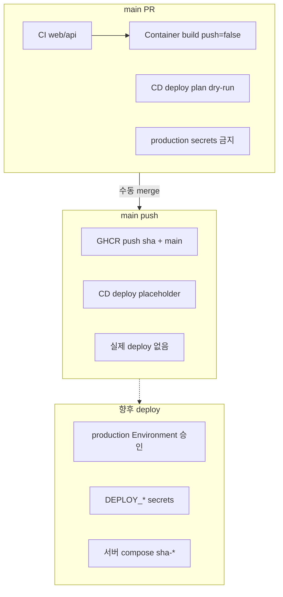

# GitHub Secrets, Variables, Environment 전략

> **상태**: 정책·설계 문서. **Repository Secrets/Variables·GitHub Environment 는 아직 생성하지 않았다.**  
> secret·credential **값은 이 문서·저장소에 적지 않는다.**

관련: [main release 준비 체크리스트](./main-release-readiness.md), [deployment 전략](./deployment-strategy.md), [compose template](../../../../deploy/compose.prod.example.yml).

---

## Secrets vs Variables 구분 기준

| 구분 | GitHub 기능 | 사용 시점 | 예 |
|------|-------------|-----------|-----|
| **민감 정보** | Repository / Environment **Secret** | 로그·PR에 노출되면 안 되는 값 | `JWT_SECRET`, `DB_PASSWORD`, SSH private key |
| **비밀 아님** | Repository **Variable** | workflow·build에 넣어도 괜찮은 설정값 | `NEXT_PUBLIC_API_URL`, image name |
| **런타임 only** | 서버 `.env.prod` / secret manager | 컨테이너 기동 시 API가 읽는 값 | [`.env.prod.example`](../../../../deploy/.env.prod.example) 항목 |

**원칙**

- main 대상 **PR** workflow 에서는 **production runtime secret 을 사용하지 않는다.**
- API/Web **런타임** secret 은 기본적으로 **배포 서버**에 둔다(GitHub에 prod DB/JWT를 넣지 않아도 됨).
- **향후 deploy job** 이 SSH 등으로 서버에 접속할 때만 GitHub **Environment `production`** secret 을 사용한다.

---

## Repository Secrets (이름·용도만)

현재 저장소에 등록된 custom secret 은 **없음**(점검 기준). 아래는 **준비할 후보 목록**이다.

### API runtime (서버 `.env.prod` 또는 secret manager — 1차 권장)

| Secret 이름 | 용도 | 주입 위치 |
|-------------|------|-----------|
| `JWT_SECRET` | JWT 서명(≥32바이트) | API container env |
| `DB_URL` | MySQL JDBC URL | API container env |
| `DB_USER` | DB 사용자 | API container env |
| `DB_PASSWORD` | DB 비밀번호 | API container env |
| `APP_CORS_ALLOWED_ORIGINS` | 운영 Web origin(comma-separated) | API container env |

### Redis / Valkey runtime (공유 store·다중 인스턴스 시)

| Secret 이름 | 용도 | 주입 위치 |
|-------------|------|-----------|
| `SPRING_DATA_REDIS_HOST` | Redis 호스트 | API container env |
| `SPRING_DATA_REDIS_PORT` | Redis 포트(비밀이면 Variable 가능) | API container env |
| `SPRING_DATA_REDIS_PASSWORD` | Redis 인증(사용 시) | API container env |

prod Redis store(`app.rate-limit.store`, `app.auth.denylist.store`)는 **별도 구현 PR** 전제([redis-security-store-policy.md](./redis-security-store-policy.md)).

### 향후 deploy 자동화 (GitHub Environment `production` 권장)

| Secret 이름 | 용도 | 주입 위치 |
|-------------|------|-----------|
| `DEPLOY_HOST` | 배포 대상 서버 호스트 | CD deploy job (미구현) |
| `DEPLOY_USER` | SSH 사용자 | CD deploy job |
| `DEPLOY_SSH_KEY` | SSH private key | CD deploy job |
| `DEPLOY_PATH` | 서버上的 compose/env 경로 | CD deploy job |

deploy job 은 **서버에 `.env.prod`를 쓰거나**, job이 SSH로 원격 `docker compose` 를 실행하는 방식 중 하나를 후속 PR에서 선택한다. API runtime secret 을 GitHub에 중복 보관할 필요는 없다.

### Actions 기본 제공 (별도 등록 불필요)

| 이름 | 용도 |
|------|------|
| `GITHUB_TOKEN` | CI, main push 시 GHCR push (`packages: write`는 push job만) |

---

## Repository Variables (이름·용도만)

| Variable 이름 | 용도 | 사용처 |
|---------------|------|--------|
| `NEXT_PUBLIC_API_URL` | 운영 API URL(Web **build arg**) | `container-images.yml` Web build; 미설정 시 CI placeholder |
| `DASIDA_IMAGE_TAG` | (정책) 배포 pin tag | **서버 `.env.prod`** — GitHub Variable 필수 아님. `sha-<shortsha>` pin 권장, `main` tag는 추적용만 |
| `GHCR_API_IMAGE` | (선택) API image 전체 이름 | 향후 deploy job; 기본값 `ghcr.io/chorok447/dasida-api` |
| `GHCR_WEB_IMAGE` | (선택) Web image 전체 이름 | 향후 deploy job; 기본값 `ghcr.io/chorok447/dasida-web` |

`DASIDA_IMAGE_TAG` 는 [deployment-strategy.md](./deployment-strategy.md) 와 [`.env.prod.example`](../../../../deploy/.env.prod.example) 에서 **sha-\*** pin 을 기본으로 한다. Repository Variable 로 고정할 수도 있으나, **rollback 단위는 배포 시점의 sha** 이므로 서버 env 또는 deploy job input 이 더 적합하다.

---

## GitHub Environment: `production`

### 권장 설계 (미적용 — 추후 CD PR)

| 항목 | 권장 |
|------|------|
| Environment 이름 | `production` |
| Protection rules | Required reviewers(1명 이상) 또는 manual approval |
| Environment secrets | `DEPLOY_*`, (선택) GHCR read PAT if not using `GITHUB_TOKEN` on server |
| Environment variables | (선택) `GHCR_API_IMAGE`, `GHCR_WEB_IMAGE`, 기본 `DASIDA_IMAGE_TAG` hint |

**당장 하지 않는 것**

- GitHub UI에서 `production` Environment **생성**
- workflow 에 `environment: production` **추가**

### 향후 deploy job 흐름 (설계)

1. `main` push → GHCR image push (`sha-*`, `main`)
2. (선택) CD workflow `deploy` job 트리거 — **`environment: production`** → 승인 gate
3. 승인 후 job 이 `DEPLOY_*` secret 으로 서버 SSH
4. 서버에서 `DASIDA_IMAGE_TAG=sha-…` 로 [`compose.prod.example.yml`](../../../../deploy/compose.prod.example.yml) 기반 pull/up
5. runtime secret 은 서버 `.env.prod`(이미 운영자가 채움) 또는 job이 원격 파일만 갱신(tag만)

---

## main PR / main push / deploy 흐름

| 단계 | Secrets/Variables | 현재 |
|------|-------------------|------|
| **develop PR** | 없음(또는 `GITHUB_TOKEN`) | auto-merge |
| **main PR** | production secret **사용 금지**; `vars.NEXT_PUBLIC_API_URL` 만 Web build(placeholder 허용) | 구현됨 |
| **main push** | `GITHUB_TOKEN` → GHCR push | 구현됨 |
| **deploy** | `production` Environment + `DEPLOY_*` + 서버 `.env.prod` | **미구현** |

---

## 서버 `.env.prod` vs GitHub

| 값 | GitHub에 둘까? | 서버에 둘까? | 비고 |
|----|----------------|--------------|------|
| `JWT_SECRET`, `DB_*`, CORS, Redis | 보통 **아니오** | **예** | [`.env.prod.example`](../../../../deploy/.env.prod.example) |
| `NEXT_PUBLIC_API_URL` | **Variable**(CI build) | image에 bake-in | 런타임 env로는 변경 불가 |
| `DASIDA_IMAGE_TAG` | 선택 | **예**(권장) | deploy/rollback 단위 |
| `DEPLOY_*` | **Environment secret**(향후) | 불필요 | job 전용 |

---

## 체크리스트 (생성 전)

- [ ] Repository Variable `NEXT_PUBLIC_API_URL` (운영 URL 확정 후)
- [ ] 서버 `.env.prod` (runtime secret — Git 제외)
- [ ] GitHub Environment `production` + protection rules (deploy PR 전)
- [ ] Environment secrets `DEPLOY_*` (deploy PR 전)
- [ ] GHCR package visibility·pull 정책 (수동 UI)

---

## 관련 문서

- [main-release-readiness.md](./main-release-readiness.md)
- [deployment-strategy.md](./deployment-strategy.md)
- [container-images.md](./container-images.md)
- [deploy/.env.prod.example](../../../../deploy/.env.prod.example)
